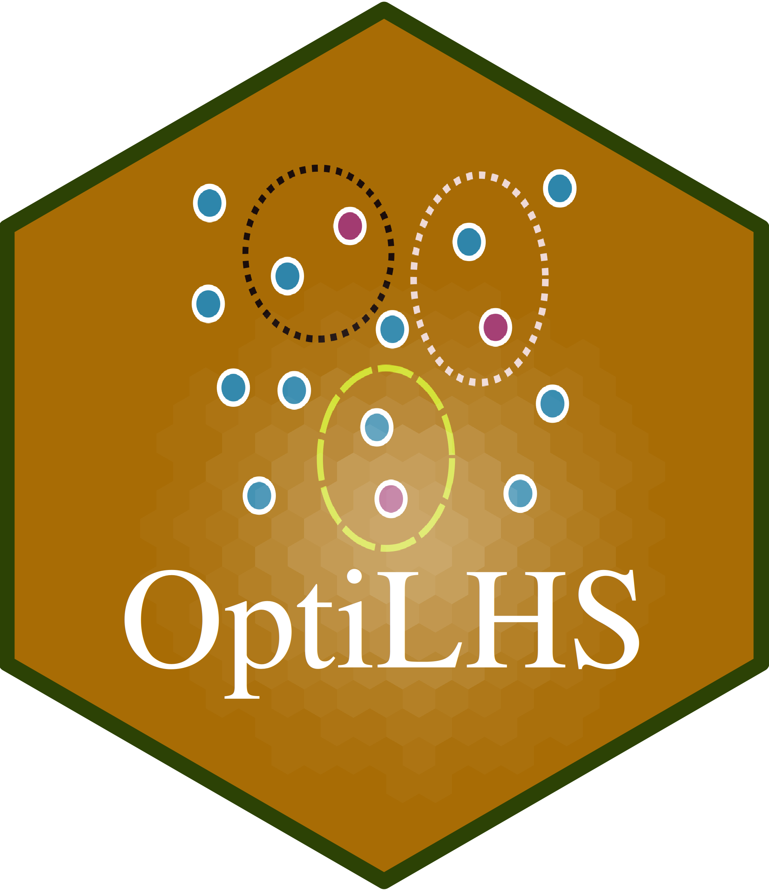

# OptiLHS: Optimized Latin Hypercube Sampling Package

[](https://www.r-project.org/)
[](https://shiny.rstudio.com/)
[](LICENSE)

<div align="center">
  
</div>

## Overview

The `OptiLHS` package provides a comprehensive Shiny application for optimizing soil sampling designs using conditioned Latin Hypercube Sampling (cLHS) methods. This package utilizes advanced optimization techniques for spatial sampling in environmental and soil science.

## Features

### Core Modules

1. **Sample Size Optimization (KL Divergence Method)**

   - Applies the method described by Malone et al. (2019) to determine appropriate sample sizes.
   - Uses Kullback-Leibler divergence to evaluate sampling efficiency
   - Fits exponential decay functions to identify optimal sample sizes
   - Provides cumulative density function analysis
2. **Random Forest Optimization**

   - Enhances cLHS designs using Random Forest-based optimization techniques according to Wadoux et al. (2019)
   - Implements simulated annealing for sampling design improvement
   - Cross-validation for Mean Squared Error (MSE) estimation
   - Comparative analysis between initial and optimized designs
3. **Alternative Site Selection**

   - Handles inaccessible sampling locations through buffer-based replacement described by Malone (2019)
   - Buffer zone analysis for finding alternative sites
   - Similarity-based replacement using environmental covariates
   - Interactive map-based site selection

### Interactive Features

- **File Upload**: Support for multiple raster formats (GeoTIFF, etc.)
- **Interactive Maps**: Leaflet-based visualization with click-to-select functionality
- **Real-time Progress**: Progress bars and notifications during optimization
- **Export Capabilities**: Download optimized sampling designs as shapefiles or CSV
- **Visualization**: Comprehensive plots for optimization results and spatial distributions

## Installation

### Prerequisites

Ensure you have R (≥ 4.0.0) and the following packages installed:

```r
# Install required packages
install.packages(c("devtools", "shiny", "shinydashboard", "shinyWidgets", 
                   "DT", "plotly", "leaflet", "terra", "sf", "dplyr", 
                   "ggplot2", "clhs", "randomForest", "cluster", 
                   "minpack.lm", "gridExtra"))
```

### Package Installation

Option 1: Install from GitHub (Recommended)

```r
# Install devtools if you haven't already
if (!require(devtools)) {
  install.packages("devtools")
}

# Install OptiLHS directly from GitHub
devtools::install_github("ccarbajal16/OptiLHS")
```

Option 2: Install using remotes package

```r
# Install remotes if you haven't already
if (!require(remotes)) {
  install.packages("remotes")
}
# Install OptiLHS directly from GitHub
remotes::install_github("ccarbajal16/OptiLHS")
```

Option 3: Install from local source (for development)

```r
# If you have cloned the repository locally
devtools::install("path/to/OptiLHS")

# Or install directly if you're in the package directory
devtools::install()
```

Installation with Dependencies
To ensure all dependencies are properly installed:

```r
# Install with all dependencies
devtools::install_github("ccarbajal16/OptiLHS", dependencies = TRUE)

# Or for development version with vignettes
devtools::install_github("ccarbajal16/OptiLHS", 
                         dependencies = TRUE, 
                         build_vignettes = TRUE)
```

## Usage

### Launching the Application

```r
# Load the package
library(OptiLHS)

# Launch the Shiny application
launch_optilhs_app()
```

### Using Individual Functions

The package also provides access to individual optimization functions:

```r
# KL divergence calculation
kl_result <- calculate_kl_divergence(population_data, sample_data)

# Sample size optimization
opt_result <- optimize_sample_size(
  population_data = your_data,
  min_samples = 10,
  max_samples = 500,
  step_size = 10,
  n_replicates = 10
)

# Random Forest optimization
rf_result <- rf_optimize_sampling(
  covariates = your_raster_data,
  n_samples = 100,
  n_iterations = 500
)

# Alternative site processing
alt_result <- process_inaccessible_sites(
  inaccessible_sites = problem_sites,
  raster_data = environmental_data,
  buffer_distance = 250
)
```

## Data Requirements

### Input Data Formats

- **Raster Data**: GeoTIFF files with environmental covariates
- **Coordinate Systems**: Any projected coordinate system (UTM recommended)
- **File Size**: Optimized for not large raster datasets (e.g., 100 MB or less)
- **Variables**: Continuous environmental variables (elevation, NDVI, slope, etc.)

### Example Data Structure

```
Environmental Layers:
├── elevation.tif
├── slope.tif
├── ndvi.tif
├── temperature.tif
└── precipitation.tif
```

## Workflow

### 1. Data Preparation

- Upload environmental raster layers
- Verify coordinate reference systems
- Check data quality and completeness

### 2. Sample Size Optimization

- Define optimization parameters (min/max samples, iterations)
- Run KL divergence analysis
- Review exponential decay fitting
- Select optimal sample size based on CDF threshold

### 3. Sampling Design Generation

- Generate initial cLHS design
- Optional: Apply Random Forest optimization
- Visualize sampling locations on interactive map

### 4. Alternative Site Selection (if needed)

- Upload inaccessible site coordinates
- Define buffer distances and similarity thresholds
- Generate alternative sampling locations
- Review and approve replacements

### 5. Export Results

- Download optimized sampling design
- Export as shapefile or CSV format
- Save optimization reports and visualizations

## Methodological Background

### KL Divergence Optimization

Based on Malone et al. (2019), this method:

- Evaluates how well sample distributions represent population distributions
- Uses multiple sample sizes with replication
- Fits exponential decay functions: `KL = b1 * exp(-k * n) + b0`
- Determines optimal sample size using cumulative density functions

### Random Forest Enhancement

- Improves upon basic cLHS designs
- Uses environmental prediction accuracy as optimization criterion
- Implements simulated annealing for global optimization
- Provides quantitative improvement metrics

### Alternative Site Algorithm

- Creates buffer zones around inaccessible locations
- Extracts environmental data within buffers
- Applies similarity metrics for site replacement
- Maintains spatial and environmental representativeness

## Package Structure

```
OptiLHS/
├── DESCRIPTION              # Package metadata and dependencies
├── NAMESPACE               # Exported functions
├── README.md               # Package documentation
├── TECHNICAL_GUIDE.md      # Technical implementation guide
├── R/                      # Core package functions
│   ├── launch_app.R        # Main app launcher
│   ├── optimization_functions.R  # KL divergence methods
│   ├── rf_optimization.R   # Random Forest optimization
│   └── alternative_sites.R # Alternative site functions
├── inst/
│   └── shiny-app/          # Shiny application files
│       ├── app.R           # Main app launcher and coordinator
│       ├── ui.R            # User interface definition
│       ├── server.R        # Server logic and reactive functions
│       ├── optimization_functions.R  # KL divergence functions
│       ├── rf_optimization.R        # Random Forest functions
│       ├── alternative_sites.R      # Alternative site functions
│       └── www/            # Static assets (logos, images)
│           ├── hex-Opti-LHS.png    # Package logo (hexagon)
│           └── logo.svg            # SVG logo
└── man/                    # Auto-generated documentation
    ├── calculate_kl_divergence.Rd
    ├── calculate_rf_mse.Rd
    ├── create_buffer_zone.Rd
    ├── extract_buffer_data.Rd
    ├── launch_optilhs_app.Rd
    ├── optimize_sample_size.Rd
    ├── process_inaccessible_sites.Rd
    ├── rf_optimize_sampling.Rd
    └── simple_clhs_sampling.Rd

```

### Getting Help

For technical issues:

1. Check the `TECHNICAL_GUIDE.md` file for more details on methods and implementation
2. Review the function documentation: `help("launch_optilhs_app")`
3. Ensure test data is available at the specified location

## References

- Malone, B.P., Minansy, B., Brungard, C. (2019). Some methods to improve the utility of conditioned Latin hypercube sampling. *PeerJ*, 7, e6451. https://doi.org/10.7717/peerj.6451
- Minasny, B., McBratney, A.B. (2006). A conditioned Latin hypercube method for sampling in the presence of ancillary information. *Computers & Geosciences*, 32(9), 1378–1388. https://doi.org/10.1016/j.cageo.2005.12.009
- Wadoux, A. M. J. C., Brus, D. J., & Heuvelink, G. B. M. (2019). Sampling design optimization for soil mapping with random forest. *Geoderma*, 355, 113913. https://doi.org/10.1016/j.geoderma.2019.113913.

## Support

For issues, questions, or contributions, please refer to the package documentation or contact the development team.

## License

This package is distributed under the MIT license. See LICENSE file for details.

## How to Cite

If you use the `OptiLHS` package in your research, please cite it as follows:

```r
@Software{,
  author = {Carlos Carbajal},
  title = {{OptiLHS}: Optimized Latin Hypercube Sampling for Spatial Designs},
  year = {2025},
  month = {September},
  version = {0.1.1},
  publisher = {GitHub},
  url = {https://github.com/ccarbajal16/OptiLHS.git},
}
```
